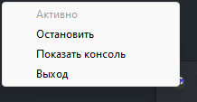

# Mine-Imator RPC
**[Инструкция для русскоговорящих](ru_README.md)**

## For non-Russian speaking users
I don't know if I will develop this program further, but there is no translation yet. If you want to translate it yourself, you can do it in code and then knock down the project yourself. [Instructions for the build](#build)

## Install
There is a choice of portable and installer versions. The installer version includes the program in the startup and has an uninstaller.

[To download, go to the latest release page](https://github.com/WolfySoCute/Mine-Imator-RPC/releases/latest/)

## Build
To bind the script into a single executable file, a `build.bat` script has already been prepared. After all changes just run it. The `Mine-Imator RPC.exe` file will appear in the `dist` folder.