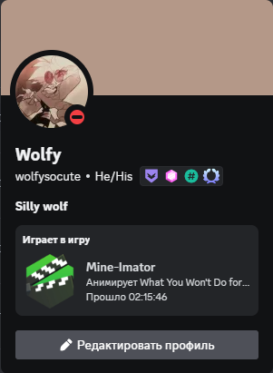

# Mine-Imator RPC
**[Instructions for non-Russian speakers](README.md)**

## Установка
На выбор предлагаются портативная(Portable) и версии с установщиком(Setup). Версия с установщиком включает программу в автозапуск и имеет деинсталлятор.

[Чтобы загрузить, перейдите на страницу последнего выпуска](https://github.com/WolfySoCute/Mine-Imator-RPC/releases/latest/)

## Сборка (для разбирающихся)
Чтобы собрать скрипт в один исполняемый файл, уже подготовлен скрипт `build_onefile.bat`. После всех изменений просто запустите его. Файл `Mine-Imator RPC.exe` появится в папке `dist`.